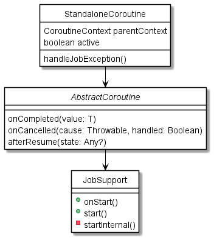

## Coroutine 源码分析

协程作为 Kotlin 简化线程池的重要手段之一，深入理解协程比较有必要。

### 了解协程的执行
由于协程在语法糖上做了很多的简化，直接看很难追述其源码实现，我们先对协程的执行进行初步的反编译，kotlin 代码如下：

```kotlin
class TestCoroutine {
    
    fun startCoroutine() {
        CoroutineScope(Dispatchers.Default).launch { 
            doSomeWork()
        }
    }
    
    private suspend fun doSomeWork() {
        println("test suspend function")
        delay(100)
    }
}
```

支持简单的测试类，并使用协程的构造类（Builders）进行协程的启动，通过反编译并转换为 Java 的代码如下：

```kotlin
public final class TestCoroutine {
   public final void startCoroutine() {
      BuildersKt.launch$default(CoroutineScopeKt.CoroutineScope((CoroutineContext)Dispatchers.getDefault()), (CoroutineContext)null, (CoroutineStart)null, (Function2)(new Function2((Continuation)null) {
         int label;

         @Nullable
         public final Object invokeSuspend(@NotNull Object $result) {
            Object var2 = IntrinsicsKt.getCOROUTINE_SUSPENDED();
            switch(this.label) {
            case 0:
               ResultKt.throwOnFailure($result);
               TestCoroutine var10000 = TestCoroutine.this;
               this.label = 1;
               if (var10000.doSomeWork(this) == var2) {
                  return var2;
               }
               break;
            case 1:
               ResultKt.throwOnFailure($result);
               break;
            default:
               throw new IllegalStateException("call to 'resume' before 'invoke' with coroutine");
            }

            return Unit.INSTANCE;
         }

         @NotNull
         public final Continuation create(@Nullable Object value, @NotNull Continuation completion) {
            Intrinsics.checkNotNullParameter(completion, "completion");
            Function2 var3 = new <anonymous constructor>(completion);
            return var3;
         }

         public final Object invoke(Object var1, Object var2) {
            return ((<undefinedtype>)this.create(var1, (Continuation)var2)).invokeSuspend(Unit.INSTANCE);
         }
      }), 3, (Object)null);
   }

   private final Object doSomeWork(Continuation $completion) {
      String var2 = "test suspend function";
      boolean var3 = false;
      System.out.println(var2);
      Object var10000 = DelayKt.delay(100L, $completion);
      return var10000 == IntrinsicsKt.getCOROUTINE_SUSPENDED() ? var10000 : Unit.INSTANCE;
   }
}

```

我们先看下 Builders api 的源码
```kotlin
public fun CoroutineScope.launch(
    context: CoroutineContext = EmptyCoroutineContext,
    start: CoroutineStart = CoroutineStart.DEFAULT,
    block: suspend CoroutineScope.() -> Unit
): Job {
    val newContext = newCoroutineContext(context)
    val coroutine = if (start.isLazy)
        LazyStandaloneCoroutine(newContext, block) else
        StandaloneCoroutine(newContext, active = true)
    coroutine.start(start, coroutine, block)
    return coroutine
}

```

launch 传入三个参数，第一个是协程上下文 `CoroutineContext`，默认为 `EmptyCoroutineContext`；第二个是启动的选项 `CoroutineStart`，是一个枚举类，DEFAULT 是默认立即启动；第三个则是协程的执行体了，也就是block里我们函数 `doSomeWork` 将会执行，值得注意的是，使用了CoroutineScope的扩展函数，这样 block 里的可以通过调用 `this` 来调用 CoroutineScope 里的公开函数和属性。

通过 launch 函数的执行代码，如果是 DEFAULT，将初始化 `StandaloneCoroutine` 的实例，并调用 start 函数启动协程。

```kotlin
private open class StandaloneCoroutine(
    parentContext: CoroutineContext,
    active: Boolean
) : AbstractCoroutine<Unit>(parentContext, initParentJob = true, active = active) {
    override fun handleJobException(exception: Throwable): Boolean {
        handleCoroutineException(context, exception)
        return true
    }
}
```
`StandaloneCoroutine`仅对 Job 异常做了处理，继承链：
StandaloneCoroutine > AbstractCoroutine > JobSupport > Job




`JobSupport`是`Job`的具体实现类，实际上是一个状态机的模式


内部状态如下：
* 新建 （NEW）：`state == EMPTY_NEW`，初始化，等待开启;
* 激活 （ACTIVE）: `state == EMPTY_ACTIVE`，激活的协程正在执行;
* 正在取消 （CANCELLING）: `state is Finishing`， 正在取消协程;
* 正在完成 （COMPLETING）: `state.isCompleting == true`，不再接收子 Job，等待最后的子 Job 完成;
* 密封 （SEALED）: `state.isSealed == true`， 此时将无法再进行异常处理
* 完成 （COMPLETE）: `state !is Incomplete`, 回调 `onComplete`;


再回过头来看下反编译的Java代码，